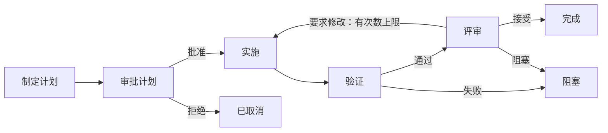

# Workflow 可视化编排可行性分析

日期：2026-09-07。分析基于当前工作区源码与官方文档；本次没有修改实现、运行工作流或检查桌面界面。

## 结论

**目前有 daemon 工作流引擎和 CLI/TUI 操作入口，但没有桌面端 Workflow 编排页面。做成 Dify 那种可拖拽、可连线的节点编辑器是可行的。**

现有持久化和执行基础可以复用，但自由添加节点、修改连接需要同时调整领域模型和执行器。仅增加画布还不足以实现真正的自定义编排。

建议首版围绕编码任务，提供 **Agent、人工审批、验证节点，以及按结果分支和有次数上限的返工**。执行权继续归 daemon；更广泛的 Dify 式通用自动化可以后续扩展。

## 一、现在已经有什么

| 能力 | 源码证据 | 对后续实现的意义 |
|---|---|---|
| 桌面编排界面 | 检索桌面 renderer、Electron 源码和依赖声明，只找到无关的本地化文案，没有 Workflow 功能页面或 React Flow 依赖 | 需要新增功能模块和导航入口 |
| 终端操作界面 | 已有 [Workflow TUI](../apps/cli/src/workflow-tui/workflow-tui.ts) 和[使用文档](../apps/web/src/content/docs/docs/workflows.mdx) | 严格说并非完全没有 UI，而是没有桌面图形编排 UI |
| 运行控制 RPC | [RPC 契约](../packages/rpc/src/index.ts) 已提供 list、get、create、start、decideGate、cancel | 可以复用运行控制，尚缺定义编辑接口 |
| 步骤与转移 | [类型定义](../packages/shared/src/workflow/types.ts) 已有 steps 和按结果选择的 transitions | 有图结构雏形，但还不是通用数据流图 |
| 内置模板 | [模板](../packages/shared/src/workflow/template.ts) 定义了 `plan_execute_review` 第 2 版 | 当前行为仍是一套固定编码流程 |
| 运行快照 | [创建逻辑](../packages/shared/src/workflow/factory.ts) 将定义复制到每次运行中 | 应保留这个边界，避免模板编辑影响已有运行 |
| 持久化 | [数据库结构](../packages/db/src/workflow/schema.ts) 已存储运行、步骤、执行尝试、产物、审批、挂起和动作 | 大量执行记录与恢复基础可以保留 |
| 架构约定 | [ADR 0002](../docs/adr/0002-daemon-owned-versioned-workflows.md) 明确 daemon 调度、绑定快照、租约和恢复职责 | 图形客户端符合现有架构方向 |

当前实际流程如下：

这些结果分支和返工次数限制都已写在[模板转移规则](../packages/shared/src/workflow/template.ts)里。

## 二、为什么还不能直接开放自由编排

### 1. 创建流程绑定固定模板

[WorkflowModule.create](../packages/daemon/src/workflow/workflow-module.ts) 始终调用 `createPlanExecuteReviewWorkflow`。定义 ID 和角色类型也只覆盖这一套流程及其三个角色。

需要让创建运行接收明确的工作流版本，并从用户保存的定义创建运行。

### 2. 起点和节点行为依赖固定 ID

[启动逻辑](../packages/shared/src/workflow/state-machine.ts) 固定从 `plan` 开始。[Agent 指令生成](../packages/daemon/src/workflow/workflow-agent-contract.ts) 只认识 plan、implement、validate、review，其他 ID 会报错。

因此，在画布上复制一个 Agent 节点，并不能自然得到可执行的新节点。需要把节点身份与行为配置分开：ID 标识节点，类型和配置决定行为。

### 3. 输入没有明确指定来源节点

[产物选择逻辑](../packages/daemon/src/workflow/workflow-agent-contract.ts) 按 schema 取最后一份匹配产物。如果两个节点生成相同类型的结果，下游无法明确区分来源。

自由编排需要显式引用“哪个节点的哪个输出”，并定义返工后应该取哪一次执行的结果。

### 4. 一次运行只支持一个当前步骤

[调度逻辑](../packages/shared/src/workflow/state-machine-support.ts) 只设置一个 `currentStepId`；[转移逻辑](../packages/shared/src/workflow/state-machine-support.ts) 只选取一条匹配转移；[步骤校验](../packages/shared/src/workflow/state-machine-support.ts) 要求操作目标就是当前步骤。

同时运行多个 Workflow，不代表单个 Workflow 内支持并行分支。后者还需要分叉、汇合和多活动节点的执行模型。

### 5. 缺少定义编辑的生命周期

当前检查到的数据库结构和 RPC 主要服务运行记录，没有独立的草稿、版本编辑接口。需要补充定义保存、草稿管理、版本生成、校验和节点坐标等画布信息的持久化。

### 6. 产物类型仍是封闭集合

[产物类型](../packages/shared/src/workflow/types.ts) 目前覆盖计划、变更集、验证报告和评审结论。通用 Agent 任务需要可配置的输出契约，或者明确限定首版支持的产物种类。

**拖动已有方框很容易；让新增节点和修改后的连接能够可靠执行，才是主要工作量。**

## 三、建议首版范围

首版应提供真正可编辑的流程，同时明确执行边界：

- 从现有编码模板创建，或新建草稿。
- 添加、拖动、复制、配置、连接和删除支持的节点。
- Agent 节点支持稳定 ID、任务指令、Agent/模型绑定、权限和有类型的输入输出；计划、实施、评审作为预设。
- 提供可持久化的人工审批节点和验证节点。当前验证是受限权限下的一次 Agent 执行；直接运行 shell 命令应作为新的执行器能力设计。
- 支持按结果选择的互斥分支，以及有次数上限的返工。回连边必须经过校验。
- 保存草稿、校验定义、生成不可变的可运行版本，并以绑定快照启动。这里的“发布版本”只表示本地版本变得可执行。
- 展示运行中、完成、失败、等待审批等状态，以及执行尝试、错误、输入输出产物和关联 Agent 会话；提供审批和取消操作。
- 重新打开后恢复已保存的图；编辑草稿不影响已有运行。

界面建议由工作流列表、中央画布、节点库、节点配置面板和运行详情面板组成。编辑与运行查看模式需要明显区分。点击节点时，应能看到有意义的配置或执行证据。

首版暂缓并行分支、任意循环、嵌套工作流、任意代码/HTTP 节点和通用变量表达式语言。这些能力都会引入当前引擎之外的新执行语义。

## 四、技术分层

| 层级 | 建议职责 |
|---|---|
| shared 领域层 | 定义结构、节点类型、入口节点、端口与输入绑定、图校验、转移规则 |
| daemon + 数据库 | 草稿与版本持久化、并发修改检查、权威校验、版本冻结、调度、权限和恢复 |
| RPC | 具名的定义增删改查、校验、版本接口，以及运行控制和状态观察 |
| Electron | 薄转发和宿主适配 |
| 桌面功能模块 | 画布交互、配置表单、尚未保存的编辑状态、运行可视化 |

业务定义应与节点坐标、视口等画布信息分开建模，两者都通过 daemon 持久化。不要直接把画布库序列化出来的对象当作执行契约。

执行器绑定应归属于节点，避免继续假定只有三个全局角色。输入引用应指向明确的产物生产者。生成可运行版本前，应检查节点缺失、不可达节点、必填输入缺失、类型不匹配、重复结果路由、缺少终止路径和无限循环。

画布可以即时提示错误，但最终校验必须在 daemon 中执行，保证 CLI 创建的流程遵守同样规则。

前端可以使用 **React Flow**。官方已提供[自定义 React 节点](https://reactflow.dev/learn/customization/custom-nodes)、[连线校验](https://reactflow.dev/examples/interaction/validation)和[图状态保存与恢复](https://reactflow.dev/examples/interaction/save-and-restore)的能力与示例。它负责编辑器交互，执行规则仍由 Cocurdex 负责。

编辑器应在功能入口按需加载，避免画布依赖进入启动路径。节点表单和工具栏复用现有应用组件与外观 token。

## 五、与 Dify 的关系及工作量

[Dify Workflow Studio](https://www.dify.ai/workflows) 将模型、工具、代码、分支、触发器和人工审核组合到可视化画布中。可以借鉴其交互方式；Cocurdex 首版更适合围绕多 Agent 编码、工作区权限、产物传递、审批与评审展开。

| 目标 | 相对规模 | 判断 |
|---|---|---|
| 固定流程的可视化运行监控 | 最小 | 主要是前端和客户端接入，但不满足自由编排需求 |
| 单活动节点的可编辑编码工作流 | 中到大 | 推荐，需要领域模型泛化、编辑器和运行详情 |
| 广泛覆盖 Dify 式通用自动化 | 大型持续投入 | 还要增加执行器、表达式与数据流、分叉汇合、循环及相应恢复机制 |

本次没有做实现原型、依赖兼容性检查或运行验证，因此不提供精确工期估算。

## 六、风险与验证重点

- **并行修改工作区：** 加入并行编码分支前，需要明确 worktree 隔离、串行化或合并机制。
- **中断恢复：** 保留持久化动作身份，验证重启不会重复发起 Agent 执行，尤其是 Agent 已修改文件但本地尚未记录完成的情况。
- **返工后的输入：** 后续评审必须使用对应的实施和验证结果，不能误取无关的最新产物。
- **版本一致性：** 等待审批时修改草稿，不得改变这次运行冻结的图和执行器绑定。
- **状态观察：** 明确快照与事件机制，客户端重连后恢复权威状态。已有 list/get 是基础，但不代表桌面状态观察流程已经完整。

实现时重点测试图校验、分支选择、返工次数上限、明确的产物来源、版本隔离、审批持久化、取消和恢复。按项目要求执行变动 TypeScript 文件检查和 Biome 检查。界面外观与交互由用户在本机验收。

建议顺序是：**先完成领域模型泛化与校验，再做可编辑画布和草稿持久化，最后补齐运行观察与恢复验证。** 固定流程可视化可以作为内部里程碑，但正式交付的首版编排功能应支持实际修改节点和连接。

## 七、交接给实施 Agent

本文是可行性分析与建议范围。实施前请结合当前源码细化数据契约和任务拆分；文中的现状对应 2026-09-07 的分析结果。

- 先阅读仓库现行 `AGENTS.md`，检查工作区已有改动，保留与本任务无关的变更。
- 按“领域模型与校验 → 定义持久化及 RPC → 画布编辑 → 运行详情与恢复”的顺序实施。
- 将内置编码流程作为新定义模型的首个模板，消除固定节点 ID 对行为的隐式绑定。
- 验收至少覆盖：新增并连接节点、保存后重新打开、从指定版本启动、审批后继续、取消运行，以及修改草稿不影响已有运行。
- 数据、权限、校验和执行规则由 daemon 管理；桌面只承担交互和展示。
- 按仓库要求完成类型与格式检查及关键语义测试，并报告未完成的验证项。

